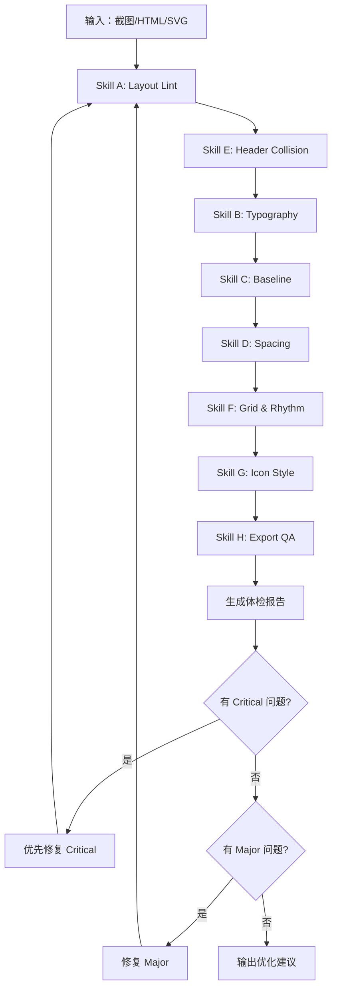

# Template Lint - 图文模板体检工具

对 HTML/SVG 海报模板进行全面的视觉体检，发现并修复布局、排版、对齐、间距等问题。

---

## 使用方式

### 方式一：完整体检（推荐）

提供截图或 HTML 文件，执行全部 8 项检查：

```
用户：帮我检查这个模板 /path/to/template.html
Claude：执行完整体检流程 A → H
```

### 方式二：针对性检查

指定检查项进行专项体检：

```
用户：检查这个模板的字体排版问题（Skill B）
用户：帮我看看图标间距为什么不对劲（Skill D）
用户：检查标题区域是否会发生重叠（Skill E）
```

---

## 体检项目总览

| ID | 名称 | 用途 | 严重级别 |
|----|------|------|----------|
| A | Layout Lint | 布局体检：安全区、重叠、对齐、组关系 | Critical |
| B | Typography Lint | 字体排版：层级、混排、字距、行距 | Major |
| C | Baseline Alignment | 基线对齐：数字+符号、中英混排 | Major |
| D | Spacing Consistency | 间距一致性：同组元素等距 | Major |
| E | Header Collision Guard | 标题防撞：文本不重叠、安全区 | Critical |
| F | Grid & Rhythm | 网格与节奏：8pt网格、垂直节奏 | Minor |
| G | Icon Consistency | 图标一致性：线宽、端点、风格 | Minor |
| H | Export QA | 导出验收：像素对齐、字体嵌入 | Major |

---

## Skill A：Layout Lint（布局体检）

**用途**：扫描重叠、边距、安全区、对齐漂移、组间节奏混乱

### 输入

- 画面截图/导出图（PNG/JPG）或 HTML/SVG 文件
- 画布尺寸（默认 1080×1440）

### 检查项

按顺序执行以下检查：

#### 1. 安全区检查

| 检查点 | 标准 | 容差 |
|--------|------|------|
| 四边留白一致性 | 左右边距相等，上下边距相等 | ±5px |
| 顶部标题区 | 距顶部 ≥80px，不挤压 | - |
| 底部页脚区 | 距底部 ≥60px | - |
| 内容区边界 | x: 80~1000, y: 100~1340 | - |

#### 2. 重叠检查

| 检查点 | 标准 |
|--------|------|
| 文本与文本 | 任意两个文本元素不得覆盖 |
| 文本与图标 | 最小间距 ≥8px |
| 装饰与内容 | 装饰元素不得遮挡核心内容 |

#### 3. 对齐检查

| 检查点 | 标准 |
|--------|------|
| 视觉居中 vs 数学居中 | 检测光学偏移（大写字母、数字需微调） |
| 组内对齐 | 同组元素基于同一对齐基准 |
| 跨组对齐 | 垂直/水平参考线一致 |

#### 4. 组关系检查

| 检查点 | 标准 |
|--------|------|
| 对齐基准 | left / center / baseline 三选一 |
| 组内间距 | 同组元素间距统一 |
| 组间间距 | 不同组之间间距 ≥ 组内间距 × 1.5 |

### 输出格式

```markdown
## Layout Lint Report

### Critical Issues
1. **[重叠]** 标题与副标题发生覆盖
   - 位置：y=120~150px 区域
   - 修复：副标题下移 20px，设置 y=170px
   - 验收：两元素间距 ≥12px

### Major Issues
2. **[安全区]** 左边距不一致
   - 问题：标题 x=100px，正文 x=95px
   - 修复：统一设置 x=100px
   - 验收：所有左对齐元素 x 值一致

### Minor Issues
3. **[对齐]** 页码未完全右对齐
   - 问题：当前 x=970px，应为 x=980px
   - 修复：设置 text-anchor="end", x=980
   - 验收：与右边距对齐
```

---

## Skill B：Typography Lint（字体排版体检）

**用途**：检查字号梯度、字距/行距、粗细、中英文混排、标点与数字对齐

### 检查项

#### 1. 字号层级

| 层级 | 推荐字号 | 字重 | 用途 |
|------|----------|------|------|
| H1 | 56-72px | 600-700 | 主标题 |
| H2 | 36-48px | 500-600 | 章节标题 |
| H3 | 28-32px | 400-500 | 副标题/强调 |
| Body | 24-32px | 400 | 正文 |
| Caption | 18-24px | 300-400 | 说明/注释 |

**检查规则**：
- 必须形成清晰的 3 级以上层级
- 相邻层级字号比 ≥1.25（推荐 1.33）
- 不允许存在"几乎一样大"的两个层级

#### 2. 中英文混排

| 检查点 | 标准 |
|--------|------|
| 基线统一 | 中英文基线对齐 |
| 字距调整 | 英文字距 letter-spacing: 0.02-0.05em |
| 字体配对 | 中文宋体配英文 serif，中文黑体配英文 sans-serif |

#### 3. 数字与符号

| 组合 | 问题 | 修复建议 |
|------|------|----------|
| `85%` | % 符号基线偏高 | % 下移 2-4px 或使用 vertical-align |
| `MATCH INDEX` + `85%` | 行距不一致 | 固定 line-height: 1.2 |
| `∞` 符号 | 可能偏大或偏小 | 缩放 0.8-0.9 |

#### 4. 行距与字距

| 元素 | 推荐行距 | 推荐字距 |
|------|----------|----------|
| 标题 | 1.1-1.3 | 0.05-0.1em |
| 正文 | 1.6-1.8 | 0-0.02em |
| 中文 | 1.8-2.0 | 0.05-0.1em |
| 英文大写 | 1.2 | 0.1-0.2em |

### 输出格式

```markdown
## Typography Lint Report

### 字号层级
- ✓ H1: 72px (主标题)
- ✓ H2: 56px (章节标题)
- ✗ H3: 54px ← 与 H2 太接近（比例 1.04），建议改为 42px

### 混排问题
1. **[基线漂移]** "85%" 中 % 符号偏高
   - 当前：同基线
   - 修复：% 添加 baseline-shift: -2px
   - 或使用 dy="2" 属性

### 建议配置
- line-height: 1.8 (中文正文)
- letter-spacing: 4px (英文标题)
- word-spacing: 0.5em (英文正文)
```

---

## Skill C：Baseline & Optical Alignment（基线与光学对齐）

**用途**：专治「85%的字符不在同一水平线」问题

### 对齐策略

#### 策略一：同基线对齐（Baseline Alignment）

适用于：字号相同或相近的混排

```svg
<text y="100">
  <tspan>85</tspan>
  <tspan>%</tspan>  <!-- 自动同基线 -->
</text>
```

#### 策略二：光学对齐（Optical Alignment）

适用于：字号差异大导致视觉跳动

```svg
<text y="100">
  <tspan font-size="64">85</tspan>
  <tspan font-size="48" dy="4">%</tspan>  <!-- % 下移补偿 -->
</text>
```

### 常见组合修正表

| 组合 | 问题 | 对齐基准 | 修正值 |
|------|------|----------|--------|
| `85` + `%` | % 视觉偏高 | baseline | % 下移 2-4px |
| `MATCH` + `INDEX` | 全大写间距 | x-height | letter-spacing +2px |
| `2026` + `年` | 数字偏高 | optical center | 年 上移 1-2px 或数字下移 |
| `♈` + `白羊座` | 符号偏大 | x-height | 符号缩放 0.85 |
| `∞` + 文字 | 符号居中偏 | optical center | ∞ 下移 3-5px |

### 输出格式

```markdown
## Baseline Alignment Report

### 需要对齐的对象
| 元素组 | 当前状态 | 对齐基准 | 修正建议 |
|--------|----------|----------|----------|
| "85" + "%" | % 偏高 3px | baseline | `<tspan dy="3">%</tspan>` |
| "MATCH INDEX" | 视觉居中 | x-height | ✓ 无需修正 |
| "∞" 符号 | 偏高 5px | optical center | `transform="translate(0, 5)"` |

### SVG 修正代码
```svg
<!-- 修正前 -->
<text>85%</text>

<!-- 修正后 -->
<text>
  <tspan>85</tspan>
  <tspan dy="3" font-size="0.8em">%</tspan>
</text>
```
```

---

## Skill D：Spacing Consistency（间距一致性）

**用途**：专治「三个图标间距不一样」问题

### 等距策略

#### 策略一：中心点等分

适用于：图标大小相同、视觉重量相近

```
|  [A]  |  [B]  |  [C]  |
   ↑        ↑        ↑
 center  center  center
   |← d →|← d →|
```

#### 策略二：外接框等分

适用于：元素大小不一、需要边缘对齐

```
|[A]    |  [B]  |    [C]|
 ↑                      ↑
left                 right
|← gap →|← gap →|
```

### 光学补偿规则

当图标视觉重量不同时（如右边更圆更重）：

| 情况 | 补偿方向 | 补偿量 |
|------|----------|--------|
| 圆形在右 | 圆形左移 | 1-3px |
| 方形在中 | 两侧略外移 | 1-2px |
| 细线条图标 | 略向重图标靠 | 2-3px |

### 检查流程

1. **测量**：获取所有同组元素的 x/y 坐标
2. **计算**：间距 = 后一个中心点 - 前一个中心点
3. **对比**：所有间距误差 ≤3px 视为合格
4. **光学检查**：视觉上是否看起来等距

### 输出格式

```markdown
## Spacing Consistency Report

### 图标组间距检查
| 间距 | 测量值 | 期望值 | 状态 |
|------|--------|--------|------|
| A→B | 120px | 120px | ✓ |
| B→C | 115px | 120px | ✗ 差 5px |

### 修复方案
1. 选中图标组
2. 执行 "Align vertical center"
3. 执行 "Distribute horizontally"
4. 光学微调：C 图标右移 2px（因为 C 更圆，视觉上偏左）

### SVG 修正
```svg
<!-- 修正前 -->
<g transform="translate(200, 0)">A</g>
<g transform="translate(320, 0)">B</g>
<g transform="translate(435, 0)">C</g>

<!-- 修正后：等距 120px -->
<g transform="translate(200, 0)">A</g>
<g transform="translate(320, 0)">B</g>
<g transform="translate(440, 0)">C</g>  <!-- +5px 修正 -->
```
```

---

## Skill E：Header Collision Guard（标题防撞）

**用途**：防止顶部「射手座×狮子座」和「定之约」发生字符侵占/挤压

### 规则

| 规则 | 标准值 | 高密度可降至 |
|------|--------|--------------|
| 标题区最小间距 | ≥12px | 8px |
| 标题容器高度 | 120-160px | 100px |
| 安全区顶部 | ≥80px | 60px |

### 文案长度适配策略

| 策略 | 触发条件 | 实现方式 |
|------|----------|----------|
| 自动换行 | 单行超出容器宽度 | 使用 `<br>` 或 `tspan` 分行 |
| 副标题缩放 | 主标题过长 | font-size 缩放 90%-100% |
| 截断 | 超出最大字数 | 仅产品明确允许时使用 |

### 检查清单

```markdown
## Header Collision Check

### 当前状态
- 主标题宽度：580px
- 副标题宽度：320px
- 两者间距：8px ← 临界值

### 兼容性测试

| 文案类型 | 示例 | 状态 |
|----------|------|------|
| 最短 | "双子×射手" | ✓ 间距 45px |
| 标准 | "射手座×狮子座" | ✓ 间距 12px |
| 最长 | "摩羯座×天蝎座·命定之约" | ✗ 重叠 |

### 修复建议
1. 推荐安全区高度：140px（当前 120px）
2. 长文案 fallback：
   - 优先：副标题字号缩放至 90%
   - 备选：主标题换行
   ```svg
   <text>
     <tspan x="100" y="100">射手座×狮子座</tspan>
     <tspan x="100" y="140">命定之约</tspan>
   </text>
   ```
```

---

## Skill F：Grid & Rhythm Builder（网格与节奏）

**用途**：让整张图的「呼吸感」稳定，不靠感觉

### 网格系统

推荐使用 **8pt 网格**（或 10pt 网格）：

| 间距名 | 值 | 用途 |
|--------|-----|------|
| xs | 8px | 紧凑间距 |
| sm | 16px | 组内间距 |
| md | 24px | 标准间距 |
| lg | 32px | 区块间距 |
| xl | 48px | 大区块间距 |
| xxl | 64px | 主要分隔 |

### 垂直节奏规则

所有垂直间距必须落在网格倍数上：

```
Header     y=90                    ← 90 = 8×11 + 2（可接受）
Title      y=200   (间距 110px)    ← 110 ≈ 8×14（微调到 112）
Subtitle   y=280   (间距 80px)     ← 80 = 8×10 ✓
Content    y=400   (间距 120px)    ← 120 = 8×15 ✓
Footer     y=1360  (间距 960px)    ← 960 = 8×120 ✓
```

### 中心轴规范

| 布局类型 | 中心轴 | 内容块宽度 |
|----------|--------|------------|
| 居中布局 | x=540 | 800-900px |
| 左对齐 | x=100 | 880px |
| 右对齐 | x=980 | 880px |

### 输出格式

```markdown
## Grid & Rhythm Report

### 网格选择：8pt grid

### 中心轴
- 类型：居中布局
- 中心轴：x=540
- 内容区宽度：880px (100 → 980)

### 垂直间距检查
| 模块 | 当前间距 | 网格值 | 修正 |
|------|----------|--------|------|
| 页眉→标题 | 70px | 72px (8×9) | +2px |
| 标题→副标题 | 45px | 48px (8×6) | +3px |
| 图标组→指数 | 24px | 24px (8×3) | ✓ |
| 指数→分割线 | 80px | 80px (8×10) | ✓ |
| 分割线→正文 | 100px | 104px (8×13) | +4px |

### 建议模块间距
- 图标组 → MATCH INDEX：24px
- MATCH INDEX → 85%：8px
- 85% → 分割线：16px
- 分割线 → 主标题：32px
```

---

## Skill G：Icon Style Consistency（图标风格一致性）

**用途**：图标线宽、圆角、端点风格不统一时一眼「廉价」

### 检查项

| 属性 | 检查点 | 推荐值 |
|------|--------|--------|
| 线宽 | 所有图标 stroke-width 一致 | 1.5-2px |
| 端点 | stroke-linecap 一致 | round |
| 拐角 | stroke-linejoin 一致 | round |
| 大小 | 同组图标尺寸比例一致 | ±5% |
| 颜色 | 同组图标颜色统一或有序 | - |
| 填充 | fill vs stroke 风格一致 | - |

### 风格对照表

| 风格 | 线宽 | 端点 | 拐角 | 示例 |
|------|------|------|------|------|
| 线性轻量 | 1.5px | round | round | Feather Icons |
| 线性标准 | 2px | round | round | Lucide |
| 填充扁平 | N/A | N/A | N/A | Font Awesome Solid |
| 双色 | 2px | round | round | Heroicons |

### 输出格式

```markdown
## Icon Consistency Report

### 当前状态
| 图标 | 线宽 | 端点 | 拐角 | 大小 |
|------|------|------|------|------|
| 星座1 | 2px | round | round | 80px |
| ∞ 符号 | 2.5px | round | miter | 40px |  ← 不一致
| 星座2 | 2px | round | round | 80px |

### 问题
1. ∞ 符号线宽 2.5px，与星座图标 2px 不一致
2. ∞ 符号使用 miter 拐角，其他使用 round

### 修复建议
统一标准：
- stroke-width: 2px
- stroke-linecap: round
- stroke-linejoin: round

```svg
<!-- 修正 ∞ 符号 -->
<path d="M-25,0 C-25,-15 ..."
      stroke-width="2"           <!-- 2.5 → 2 -->
      stroke-linecap="round"
      stroke-linejoin="round"/>  <!-- miter → round -->
```
```

---

## Skill H：Export QA（导出验收）

**用途**：避免「看着齐，导出后虚」

### 检查项

#### 1. 像素对齐

| 检查点 | 问题 | 修复 |
|--------|------|------|
| 0.5px 坐标 | 线条发虚 | 取整到整数 |
| 奇数宽度 | 居中后有 0.5px | 改为偶数宽度 |
| transform | 小数位移 | 四舍五入 |

```svg
<!-- 问题 -->
<rect x="100.5" y="200.5" width="99" .../>

<!-- 修复 -->
<rect x="100" y="200" width="100" .../>
```

#### 2. 字体处理

| 平台 | 策略 |
|------|------|
| Web | 确保 @import 或 @font-face 正确加载 |
| 导出 PNG | 等待字体加载（≥2秒） |
| 矢量 | 转曲（text → path） |

#### 3. 导出规格

| 用途 | 倍率 | 尺寸 | 格式 |
|------|------|------|------|
| 预览 | 1x | 1080×1440 | PNG |
| 小红书 | 2x | 2160×2880 | PNG |
| 印刷 | 3x | 3240×4320 | PNG/PDF |

### 验收截图点位

在以下位置截取局部放大，检查是否清晰：

1. **左上角边界**：检查安全区边距
2. **标题区**：检查字体渲染
3. **图标区**：检查线条是否发虚
4. **页脚页码**：检查小字清晰度
5. **渐变边界**：检查是否有色带

### 输出格式

```markdown
## Export QA Report

### 像素对齐检查
| 元素 | 当前值 | 修正值 | 状态 |
|------|--------|--------|------|
| 分隔线 x | 100.5 | 100 | ✗ |
| 页码 y | 1390 | 1390 | ✓ |
| 图标 transform | translate(540.3, 320) | translate(540, 320) | ✗ |

### 字体检查
- [ ] @import 字体链接可访问
- [x] 中文字体：Noto Serif SC
- [x] 英文字体：Georgia
- [ ] 等待时间：需 ≥2秒

### 导出建议
- 小红书发布：2x (2160×2880) PNG
- 使用截图工具：`poster_screenshot.py`
- 等待字体加载：已内置 2 秒等待

### 验收点位截图
1. 标题区 [x=100, y=100, w=400, h=100] - 检查字体
2. 图标区 [x=400, y=280, w=280, h=150] - 检查线条
3. 页脚区 [x=900, y=1340, w=100, h=60] - 检查小字
```

---

## 完整体检流程



---

## 报告模板

```markdown
# Template Lint Report

**文件**：{filename}
**尺寸**：{width}×{height}
**检查时间**：{datetime}

## Summary

| 级别 | 数量 | 状态 |
|------|------|------|
| Critical | {n} | {status} |
| Major | {n} | {status} |
| Minor | {n} | {status} |

## Critical Issues

{critical_issues}

## Major Issues

{major_issues}

## Minor Issues / Suggestions

{minor_issues}

## 修复代码

{fix_code}

---

**检查项**：A B C D E F G H
**通过项**：{passed}
**待修复**：{failed}
```

---

## 相关文档

| 文档 | 说明 |
|------|------|
| [grid-system.md](reference/grid-system.md) | 8pt 网格系统详解 |
| [typography-scale.md](reference/typography-scale.md) | 字号比例与层级 |
| [optical-alignment.md](reference/optical-alignment.md) | 光学对齐参考 |
