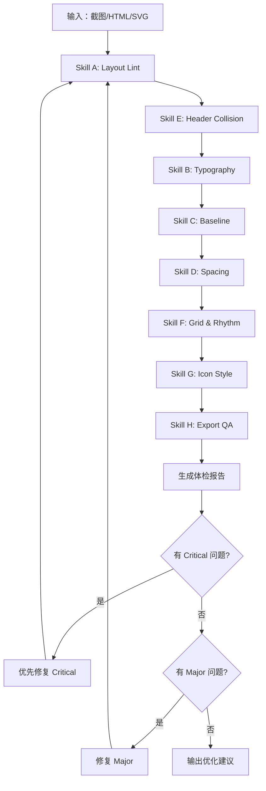

# Template Lint - 图文模板体检工具

对 HTML/SVG 海报模板进行全面视觉体检，发现并修复布局、排版、对齐、间距、图标风格、导出质量等问题，输出带 SVG/CSS 修复代码的分级报告。

---

## 使用方式

### 方式一：完整体检（推荐）

提供截图或 HTML/SVG 文件，按 A → H 顺序执行全部 8 项检查：

```
用户：帮我检查这个模板 /path/to/template.html
Claude：执行完整体检流程 A → H，生成体检报告
```

### 方式二：针对性检查

指定检查项进行专项体检：

```
用户：检查这个模板的字体排版问题（Skill B）
用户：帮我看看图标间距为什么不对劲（Skill D）
用户：检查标题区域是否会发生重叠（Skill E）
```

---

## 体检项目总览

| ID | 名称 | 用途 | 严重级别 | 详细参考 |
|----|------|------|----------|----------|
| A | Layout Lint | 布局体检：安全区、重叠、对齐、组关系 | Critical | [skills/layout-lint.md](skills/layout-lint.md) |
| B | Typography Lint | 字体排版：层级、混排、字距、行距 | Major | [skills/typography-lint.md](skills/typography-lint.md) |
| C | Baseline Alignment | 基线对齐：数字+符号、中英混排 | Major | [skills/baseline-alignment.md](skills/baseline-alignment.md) |
| D | Spacing Consistency | 间距一致性：同组元素等距 | Major | [skills/spacing-consistency.md](skills/spacing-consistency.md) |
| E | Header Collision Guard | 标题防撞：文本不重叠、安全区 | Critical | [skills/header-collision.md](skills/header-collision.md) |
| F | Grid & Rhythm | 网格与节奏：8pt网格、垂直节奏 | Minor | [skills/grid-rhythm.md](skills/grid-rhythm.md) |
| G | Icon Consistency | 图标一致性：线宽、端点、风格 | Minor | [skills/icon-consistency.md](skills/icon-consistency.md) |
| H | Export QA | 导出验收：像素对齐、字体嵌入 | Major | [skills/export-qa.md](skills/export-qa.md) |

---

## 完整体检流程


```mermaid
flowchart TD
    A[输入：截图/HTML/SVG] --> B[Skill A: Layout Lint]
    B --> C[Skill E: Header Collision]
    C --> D[Skill B: Typography]
    D --> E[Skill C: Baseline]
    E --> F[Skill D: Spacing]
    F --> G[Skill F: Grid & Rhythm]
    G --> H[Skill G: Icon Style]
    H --> I[Skill H: Export QA]
    I --> J[生成体检报告]
    J --> K{有 Critical 问题?}
    K -->|是| L[优先修复 Critical]
    K -->|否| M{有 Major 问题?}
    M -->|是| N[修复 Major]
    M -->|否| O[输出优化建议]
    L --> B
    N --> B
```

---

## 各项检查核心标准

### A · Layout Lint
- 四边留白一致（容差 ±5px）；顶部 ≥80px，底部 ≥60px
- 任意两文本元素不得覆盖；同组元素对齐基准统一，组间间距 ≥ 组内间距 × 1.5

### B · Typography Lint
- 必须形成 ≥3 级字号层级；相邻层级字号比 ≥1.25（推荐 1.33）
- 中英混排：基线对齐，中文黑体配英文 sans-serif，中文宋体配英文 serif

### C · Baseline Alignment
- 同字号混排用 `baseline` 对齐；字号差异大时用 `dy` 做光学补偿
- 常见问题：`%` 偏高 → `dy="2~4"`；`∞` 符号偏高 → `translate(0, 3~5)`

### D · Spacing Consistency
- 同组元素中心点间距误差 ≤3px 视为合格
- 视觉重量较重的图标向重侧光学补偿 1-3px

### E · Header Collision Guard
- 标题区最小间距 ≥12px（高密度可降至 8px）；顶部安全区 ≥80px
- 长文案优先缩放副标题至 90-100%，其次 `tspan` 换行，最后截断

### F · Grid & Rhythm
- 推荐 8pt 网格：xs=8 / sm=16 / md=24 / lg=32 / xl=48 / xxl=64px
- 所有垂直间距取 8 的倍数，容差 ±2px

### G · Icon Consistency
- 同组图标 `stroke-width` 一致（推荐 1.5-2px）、`stroke-linecap/linejoin: round`、尺寸误差 ≤5%

### H · Export QA
- 坐标/位移取整数，避免 0.5px 导致线条发虚；字体加载等待 ≥2 秒，矢量导出前 text → path 转曲
- 导出规格：预览 1x (1080×1440)，小红书 2x (2160×2880)，印刷 3x PNG/PDF

---

## 可执行检查代码示例

以下代码示例展示如何用程序解析 SVG/HTML 文件并量化验证检查项，减少人工推断。

### Skill A · 安全区边距提取（Python）

```python
"""
解析 SVG 文件，提取所有顶层元素的边界框，
验证上下左右安全区是否满足：顶部 ≥80px，底部 ≥60px，左右误差 ≤5px。
"""
from xml.etree import ElementTree as ET

def check_safe_margins(svg_path: str):
    tree = ET.parse(svg_path)
    root = tree.getroot()
    ns = {"svg": "http://www.w3.org/2000/svg"}

    # 读取画布尺寸
    width = float(root.attrib.get("width", 0))
    height = float(root.attrib.get("height", 0))

    issues = []
    lefts, rights, tops, bottoms = [], [], [], []

    for elem in root.findall(".//*[@x]", ns):
        x = float(elem.attrib.get("x", 0))
        y = float(elem.attrib.get("y", 0))
        w = float(elem.attrib.get("width", 0))
        h = float(elem.attrib.get("height", 0))
        lefts.append(x)
        rights.append(width - (x + w))
        tops.append(y)
        bottoms.append(height - (y + h))

    if tops:
        min_top = min(tops)
        min_bottom = min(bottoms)
        margin_left = min(lefts)
        margin_right = min(rights)

        if min_top < 80:
            issues.append(f"[Critical] 顶部安全区不足：{min_top:.1f}px（需 ≥80px）")
        if min_bottom < 60:
            issues.append(f"[Critical] 底部安全区不足：{min_bottom:.1f}px（需 ≥60px）")
        if abs(margin_left - margin_right) > 5:
            issues.append(
                f"[Major] 左右边距不对称：左={margin_left:.1f}px，右={margin_right:.1f}px（容差 ±5px）"
            )

    return issues if issues else ["[Pass] 安全区边距检查通过"]

# 使用示例
for msg in check_safe_margins("poster.svg"):
    print(msg)
```

### Skill C · 基线偏移检查（JavaScript）

```js
/**
 * 扫描 SVG DOM 中所有 <text> / <tspan> 元素，
 * 检测混排时缺失 dy 补偿的情况（%、∞ 等符号易偏高）。
 */
function checkBaselineAlignment(svgElement) {
  const issues = [];
  const HIGH_SYMBOLS = ["%", "∞", "°", "†"];

  svgElement.querySelectorAll("text, tspan").forEach((el) => {
    const content = el.textContent.trim();
    const hasMixedScript =
      /[\u4e00-\u9fff]/.test(content) && /[A-Za-z0-9]/.test(content);
    const hasHighSymbol = HIGH_SYMBOLS.some((s) => content.includes(s));
    const hasDy = el.hasAttribute("dy");
    const dominantBaseline = el.getAttribute("dominant-baseline");

    if (hasMixedScript && dominantBaseline !== "baseline") {
      issues.push({
        level: "Major",
        element: el.outerHTML.slice(0, 80),
        message: "中英混排未设置 dominant-baseline='baseline'",
      });
    }
    if (hasHighSymbol && !hasDy) {
      issues.push({
        level: "Major",
        element: el.outerHTML.slice(0, 80),
        message: `含偏高符号（${HIGH_SYMBOLS.filter((s) => content.includes(s)).join("、")}）但缺少 dy 补偿，建议 dy="2~4"`,
      });
    }
  });

  return issues.length ? issues : [{ level: "Pass", message: "基线对齐检查通过" }];
}

// 使用示例（浏览器控制台）
const svg = document.querySelector("svg");
console.table(checkBaselineAlignment(svg));
```

---

## 报告模板

```markdown
# Template Lint Report

**文件**：{filename}
**尺寸**：{width}×{height}
**检查时间**：{datetime}

## Summary

| 级别 | 数量 | 状态 |
|------|------|------|
| Critical | {n} | {status} |
| Major | {n} | {status} |
| Minor | {n} | {status} |

## Critical Issues

{critical_issues}

## Major Issues

{major_issues}

## Minor Issues / Suggestions

{minor_issues}

## 修复代码

### 示例：Skill C · 基线对齐修复（dy 补偿）

**问题**：`85%` 中百分号偏高，视觉上脱离数字基线。

**修复前**
```svg
<text x="120" y="200" font-size="48">85%</text>
```

**修复后**：拆分 `tspan`，对 `%` 施加 `dy` 向下补偿 3px
```svg
<text x="120" y="200" font-size="48" dominant-baseline="baseline">
  <tspan>85</tspan><tspan dy="3" font-size="32">%</tspan>
</text>
```

> 其余检查项的修复代码按同等格式在此追加，每条包含问题说明、修复前、修复后三部分。

---

**检查项**：A B C D E F G H
**通过项**：{passed}
**待修复**：{failed}
```

---

## 设计参考文档

| 文档 | 说明 |
|------|------|
| [reference/grid-system.md](reference/grid-system.md) | 8pt 网格系统详解 |
| [reference/typography-scale.md](reference/typography-scale.md) | 字号比例与层级 |
| [reference/optical-alignment.md](reference/optical-alignment.md) | 光学对齐参考 |
| [reference/design-tokens.md](reference/design-tokens.md) | 字号、间距、网格统一设计令牌 |
