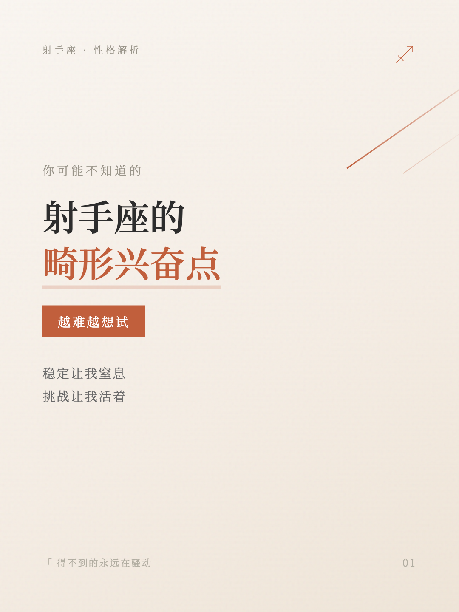
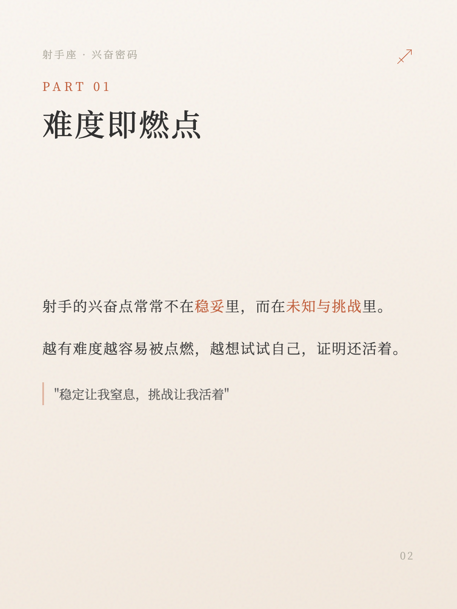

# 动态编辑风 (Editorial Dynamic) 封面模板规范

## 设计理念

与 `editorial-warm` 的静态居中布局不同，本模板强调：

- **打破对称** — 使用非对称布局，增加视觉张力
- **独特装饰** — 每个封面根据主题设计专属装饰元素
- **大面积重点色** — 重点色用于色块、装饰线、渐变条等大面积元素
- **视觉冲击** — 更强的视觉层次和吸引力

---

## 示例效果

### 封面示例



**特点**：斜线装饰 + 非对称布局 + 色块副标题 + 关键词下划线

### 内容页示例



**特点**：左对齐正文 + 重点色强调词 + 引用区块

---

## 画布尺寸

**尺寸**：1080px × 1440px（3:4 比例）

---

## 配色规范

### 基础色板

| 用途 | 色值 | 说明 |
|------|------|------|
| 重点色 | `#C15F3C` | 赭红/珊瑚橙，用于强调 |
| 重点色渐变 | `#C15F3C → #D4765A` | 用于色块渐变 |
| 主文字 | `#2D2D2D` | 深灰，标题 |
| 次文字 | `#3D3D3D` | 次深灰，副标题 |
| 正文 | `#5A5A5A` ~ `#7A7A7A` | 中灰，段落文字 |
| 弱化文字 | `#9A958A` ~ `#B1ADA1` | 浅灰，标签/页码/引用 |

### 装饰色（重点色透明度变体）

| 透明度 | 色值 | 用途 |
|--------|------|------|
| 4-6% | `rgba(193,95,60,0.04-0.06)` | 大字号背景装饰 |
| 8-10% | `rgba(193,95,60,0.08-0.1)` | 圆形填充装饰 |
| 15% | `rgba(193,95,60,0.15)` | 淡色图标/边框 |
| 20-25% | `rgba(193,95,60,0.2-0.25)` | 关键词下划线 |

### 背景渐变

```css
/* 渐变方向可根据内容调整：150°/165°/180° */
.poster {
  background: linear-gradient(
    165deg,
    #FAF6F1 0%,
    #F5EDE4 50%,
    #F0E6D9 100%
  );
}
```

### 纸张纹理

```css
.poster::before {
  content: '';
  position: absolute;
  inset: 0;
  background-image: url("data:image/svg+xml,...");
  opacity: 0.04-0.06;  /* 根据背景调整 */
  pointer-events: none;
  z-index: 1;
}
```

---

## 字体规范

```css
font-family: 'Noto Serif SC', serif;
```

| 元素 | 字号 | 字重 | 字距 |
|------|------|------|------|
| **日期+星座** | **48-56px** | **600** | **4-6px** |
| 主标题 | 72-84px | 500-600 | 2-4px |
| 副标题/强调 | 32-42px | 400-500 | 3-4px |
| 正文 | 28-32px | 400 | 2-3px |
| 标签 | 20-24px | 400 | 6-8px |
| 页码 | 24px | 400 | 4px |

### 每日运势专用样式

日期+星座是每日运势封面的**视觉焦点**，需要特别突出：

```css
.date-zodiac {
  font-size: 52px;           /* 大字号，一眼可见 */
  font-weight: 600;          /* 加粗强调 */
  color: #2D2D2D;            /* 深色主文字 */
  letter-spacing: 5px;       /* 舒适字距 */
  text-align: center;
  margin-bottom: 20px;
}

/* 可选：添加装饰下划线 */
.date-zodiac::after {
  content: '';
  display: block;
  width: 60%;
  height: 2px;
  background: linear-gradient(90deg, transparent, #C15F3C, transparent);
  margin: 16px auto 0;
}
```

---

## 装饰元素库

### 1. 大字号背景文字

用于年份、月份等数字装饰。

```css
.year-bg {
  position: absolute;
  top: 180px; left: -60px;
  font-size: 320px;
  font-weight: 700;
  color: rgba(193, 95, 60, 0.06);
  letter-spacing: -20px;
  z-index: 0;
}
```

**适用主题**：年度运势、月运势、数字相关

### 2. 斜线装饰

体现张力和动感。

```css
.deco-line {
  position: absolute;
  width: 400px; height: 3px;
  background: linear-gradient(90deg, #C15F3C 0%, transparent 100%);
  transform: rotate(-35deg);
  top: 280px; right: -100px;
}
```

**适用主题**：性格解析、兴奋点、挑战类

### 3. 圆形装饰

体现温和、稳定。

```css
.circle-deco {
  position: absolute;
  width: 180px; height: 180px;
  border: 2px solid rgba(193, 95, 60, 0.15);
  border-radius: 50%;
}
.circle-inner {
  width: 100px; height: 100px;
  background: rgba(193, 95, 60, 0.08);
  border-radius: 50%;
}
```

**适用主题**：月运势、心态类、情感类

### 4. 竖线装饰组

体现规则感、条理性。

```css
.side-lines {
  position: absolute;
  left: 60px; top: 300px;
}
.side-line {
  width: 3px;
  background: #C15F3C;
  margin-bottom: 12px;
}
.side-line:nth-child(1) { height: 120px; }
.side-line:nth-child(2) { height: 80px; opacity: 0.6; }
.side-line:nth-child(3) { height: 50px; opacity: 0.3; }
```

**适用主题**：规则清单、指南类、列表类

### 5. 箭头装饰

体现方向、指引。

```css
.arrow-deco svg {
  width: 200px; height: 200px;
  stroke: rgba(193, 95, 60, 0.12);
  stroke-width: 2;
  fill: none;
}
```

```html
<svg viewBox="0 0 100 100">
  <line x1="10" y1="90" x2="90" y2="10" stroke-linecap="round"/>
  <polyline points="60,10 90,10 90,40" stroke-linecap="round" stroke-linejoin="round"/>
</svg>
```

**适用主题**：职业方向、选择类、规划类

### 6. 底部渐变色带

增加视觉完整度。

```css
.gradient-band {
  position: absolute;
  bottom: 0; left: 0; right: 0;
  height: 8px;
  background: linear-gradient(90deg, #C15F3C 0%, #D4765A 50%, #E8A88C 100%);
}
```

**适用主题**：通用，增强品牌感

### 7. 放大淡色星座图标

用于留白区域装饰。

```css
.zodiac-icon svg {
  width: 140px; height: 140px;
  stroke: rgba(193, 95, 60, 0.15);
  stroke-width: 1;
  fill: none;
}
```

**适用主题**：自由、孤独、情感类

### 8. 点阵装饰

体现规律、科技感。

```css
.dot-grid {
  position: absolute;
  top: 200px; right: 80px;
  display: grid;
  grid-template-columns: repeat(4, 1fr);
  gap: 16px;
}
.dot {
  width: 6px; height: 6px;
  border-radius: 50%;
  background: rgba(193, 95, 60, 0.15);
}
/* 随机隐藏部分点增加变化 */
.dot:nth-child(3), .dot:nth-child(7), .dot:nth-child(11) {
  opacity: 0;
}
```

**适用主题**：分析类、数据类、理性类

### 9. 角标装饰

体现精致、框架感。

```css
.corner-bracket {
  position: absolute;
  width: 60px; height: 60px;
  border: 2px solid rgba(193, 95, 60, 0.2);
}
.corner-bracket.top-left {
  top: 80px; left: 70px;
  border-right: none; border-bottom: none;
}
.corner-bracket.bottom-right {
  bottom: 80px; right: 70px;
  border-left: none; border-top: none;
}
```

**适用主题**：精选、推荐、框架类

### 10. 大引号装饰

体现引用、金句感。

```css
.quote-mark {
  position: absolute;
  font-size: 200px;
  font-family: Georgia, serif;
  color: rgba(193, 95, 60, 0.08);
  line-height: 1;
}
.quote-mark.open {
  top: 180px; left: 60px;
  content: '"';
}
.quote-mark.close {
  bottom: 200px; right: 60px;
  content: '"';
}
```

**适用主题**：金句类、语录类、感悟类

### 11. 波浪线装饰

体现流动、柔和感。

```css
.wave-line {
  position: absolute;
  bottom: 200px; left: 0; right: 0;
  height: 40px;
  background: url("data:image/svg+xml,%3Csvg viewBox='0 0 1200 40' xmlns='http://www.w3.org/2000/svg'%3E%3Cpath d='M0,20 Q150,0 300,20 T600,20 T900,20 T1200,20' stroke='rgba(193,95,60,0.1)' stroke-width='2' fill='none'/%3E%3C/svg%3E");
  background-repeat: no-repeat;
  background-size: cover;
}
```

**适用主题**：情感类、心态类、流动类

### 12. 数字序列装饰

体现排序、编号感。

```css
.number-deco {
  position: absolute;
  top: 300px; left: 50px;
  font-size: 120px;
  font-weight: 700;
  color: rgba(193, 95, 60, 0.06);
  letter-spacing: -8px;
  writing-mode: vertical-lr;
}
/* 显示如 "01 02 03" */
```

**适用主题**：排行类、步骤类、清单类

### 13. 横条纹装饰

体现层次、节奏感。

```css
.stripes {
  position: absolute;
  top: 250px; right: 60px;
  display: flex;
  flex-direction: column;
  gap: 8px;
}
.stripe {
  height: 3px;
  background: #C15F3C;
  border-radius: 2px;
}
.stripe:nth-child(1) { width: 80px; }
.stripe:nth-child(2) { width: 120px; opacity: 0.6; }
.stripe:nth-child(3) { width: 60px; opacity: 0.3; }
```

**适用主题**：节奏类、进度类、层级类

### 14. 菱形装饰

体现几何、精致感。

```css
.diamond {
  position: absolute;
  width: 100px; height: 100px;
  border: 2px solid rgba(193, 95, 60, 0.12);
  transform: rotate(45deg);
}
.diamond-inner {
  position: absolute;
  width: 60px; height: 60px;
  background: rgba(193, 95, 60, 0.05);
  transform: rotate(45deg);
}
```

**适用主题**：特别类、精选类、亮点类

### 15. 半圆弧线装饰

体现优雅、弧度、包容感。

```css
.arc-deco {
  position: absolute;
  top: 200px; right: 80px;
  width: 200px; height: 100px;
  border: 2px solid rgba(193, 95, 60, 0.15);
  border-bottom: none;
  border-radius: 100px 100px 0 0;
}
.arc-deco-inner {
  position: absolute;
  top: 220px; right: 110px;
  width: 140px; height: 70px;
  border: 2px solid rgba(193, 95, 60, 0.08);
  border-bottom: none;
  border-radius: 70px 70px 0 0;
}
```

**适用主题**：保护类、包容类、温柔类、升起类

### 16. 放射线/星芒装饰

体现能量、闪耀、聚焦感。

```css
.starburst {
  position: absolute;
  top: 180px; left: 50%;
  transform: translateX(-50%);
  width: 300px; height: 300px;
}
.starburst svg {
  width: 100%; height: 100%;
  stroke: rgba(193, 95, 60, 0.08);
  stroke-width: 1;
  fill: none;
}
```

```html
<svg viewBox="0 0 100 100">
  <!-- 8条放射线 -->
  <line x1="50" y1="50" x2="50" y2="10"/>
  <line x1="50" y1="50" x2="78" y2="22"/>
  <line x1="50" y1="50" x2="90" y2="50"/>
  <line x1="50" y1="50" x2="78" y2="78"/>
  <line x1="50" y1="50" x2="50" y2="90"/>
  <line x1="50" y1="50" x2="22" y2="78"/>
  <line x1="50" y1="50" x2="10" y2="50"/>
  <line x1="50" y1="50" x2="22" y2="22"/>
</svg>
```

**适用主题**：能量类、闪耀类、高光时刻、重要日子

### 17. 月相装饰

体现周期、变化、神秘感，与星座主题契合。

```css
.moon-phase {
  position: absolute;
  top: 180px; right: 100px;
  width: 80px; height: 80px;
}
/* 新月 */
.moon-new {
  border: 2px solid rgba(193, 95, 60, 0.15);
  border-radius: 50%;
}
/* 满月 */
.moon-full {
  background: rgba(193, 95, 60, 0.08);
  border-radius: 50%;
}
/* 上弦月/下弦月 */
.moon-half {
  background: linear-gradient(90deg,
    rgba(193, 95, 60, 0.08) 50%,
    transparent 50%);
  border: 2px solid rgba(193, 95, 60, 0.15);
  border-radius: 50%;
}
```

**适用主题**：周期类、变化类、月运势、神秘类

### 18. 星星散布装饰

体现星空、梦幻、浪漫感。

```css
.stars-scatter {
  position: absolute;
  top: 150px; right: 60px;
  width: 200px; height: 200px;
}
.star {
  position: absolute;
  width: 8px; height: 8px;
  background: #C15F3C;
  clip-path: polygon(50% 0%, 61% 35%, 98% 35%, 68% 57%, 79% 91%, 50% 70%, 21% 91%, 32% 57%, 2% 35%, 39% 35%);
}
.star:nth-child(1) { top: 20px; left: 30px; opacity: 0.3; }
.star:nth-child(2) { top: 60px; left: 120px; opacity: 0.5; transform: scale(0.7); }
.star:nth-child(3) { top: 100px; left: 50px; opacity: 0.2; transform: scale(1.2); }
.star:nth-child(4) { top: 40px; left: 160px; opacity: 0.4; transform: scale(0.5); }
.star:nth-child(5) { top: 140px; left: 100px; opacity: 0.25; }
```

**适用主题**：梦幻类、浪漫类、许愿类、星座运势

### 19. 十字/加号装饰组

体现精确、平衡、医学/治愈感。

```css
.cross-group {
  position: absolute;
  top: 250px; left: 70px;
}
.cross {
  position: relative;
  width: 24px; height: 24px;
  margin-bottom: 20px;
}
.cross::before, .cross::after {
  content: '';
  position: absolute;
  background: rgba(193, 95, 60, 0.2);
}
.cross::before {
  width: 2px; height: 100%;
  left: 50%; transform: translateX(-50%);
}
.cross::after {
  width: 100%; height: 2px;
  top: 50%; transform: translateY(-50%);
}
.cross:nth-child(2) { opacity: 0.6; transform: scale(0.7); }
.cross:nth-child(3) { opacity: 0.3; transform: scale(0.5); }
```

**适用主题**：治愈类、平衡类、健康类、和谐类

### 20. 虚线路径装饰

体现轨迹、旅程、连接感。

```css
.dash-path {
  position: absolute;
  top: 200px; right: 80px;
  width: 180px; height: 180px;
}
.dash-path svg {
  width: 100%; height: 100%;
  stroke: rgba(193, 95, 60, 0.15);
  stroke-width: 2;
  stroke-dasharray: 8 6;
  fill: none;
}
```

```html
<svg viewBox="0 0 100 100">
  <!-- 曲线路径 -->
  <path d="M10,80 Q30,20 50,50 T90,20" stroke-linecap="round"/>
  <!-- 端点标记 -->
  <circle cx="10" cy="80" r="4" fill="rgba(193,95,60,0.2)"/>
  <circle cx="90" cy="20" r="4" fill="rgba(193,95,60,0.3)"/>
</svg>
```

**适用主题**：旅程类、成长类、轨迹类、发展类

### 21. 三角形装饰组

体现方向、锐利、稳定感。

```css
.triangle-group {
  position: absolute;
  top: 220px; right: 100px;
}
.triangle {
  width: 0; height: 0;
  border-left: 30px solid transparent;
  border-right: 30px solid transparent;
  border-bottom: 50px solid rgba(193, 95, 60, 0.08);
  margin-bottom: 15px;
}
.triangle:nth-child(2) {
  border-bottom-color: rgba(193, 95, 60, 0.05);
  transform: scale(0.7) translateX(20px);
}
.triangle:nth-child(3) {
  border-bottom-color: rgba(193, 95, 60, 0.03);
  transform: scale(0.5) translateX(-30px);
}
/* 倒三角变体 */
.triangle-down {
  border-bottom: none;
  border-top: 50px solid rgba(193, 95, 60, 0.08);
}
```

**适用主题**：稳定类、向上类、攀升类、目标类

### 22. 双线边框装饰

体现高级、杂志感、精致感。

```css
.double-border {
  position: absolute;
  top: 100px; left: 60px; right: 60px; bottom: 100px;
  border: 1px solid rgba(193, 95, 60, 0.1);
}
.double-border::before {
  content: '';
  position: absolute;
  top: 8px; left: 8px; right: 8px; bottom: 8px;
  border: 1px solid rgba(193, 95, 60, 0.06);
}
/* 仅角落变体 */
.double-border-corners {
  position: absolute;
}
.double-border-corners .corner {
  position: absolute;
  width: 40px; height: 40px;
  border: 1px solid rgba(193, 95, 60, 0.12);
}
.double-border-corners .corner::before {
  content: '';
  position: absolute;
  top: 6px; left: 6px;
  width: 28px; height: 28px;
  border: 1px solid rgba(193, 95, 60, 0.08);
}
```

**适用主题**：精品类、杂志类、高端类、专题类

### 23. 书法笔触装饰

体现东方、艺术、手写感。

```css
.brush-stroke {
  position: absolute;
  top: 280px; left: 50px;
  width: 120px; height: 20px;
}
.brush-stroke svg {
  width: 100%; height: 100%;
  stroke: rgba(193, 95, 60, 0.2);
  stroke-width: 4;
  stroke-linecap: round;
  fill: none;
}
```

```html
<svg viewBox="0 0 120 20">
  <!-- 自然笔触效果 -->
  <path d="M5,15 Q20,5 40,12 T80,8 T115,14"
        stroke-width="3"
        style="stroke-dasharray: 2 0; stroke-linecap: round;"/>
</svg>
```

**适用主题**：艺术类、东方类、禅意类、书写类

### 24. 环形进度装饰

体现周期、完成度、循环感。

```css
.ring-progress {
  position: absolute;
  top: 180px; right: 80px;
  width: 120px; height: 120px;
}
.ring-progress svg {
  width: 100%; height: 100%;
  transform: rotate(-90deg);
}
.ring-bg {
  stroke: rgba(193, 95, 60, 0.08);
  stroke-width: 3;
  fill: none;
}
.ring-fill {
  stroke: rgba(193, 95, 60, 0.25);
  stroke-width: 3;
  fill: none;
  stroke-dasharray: 283;  /* 2 * PI * 45 */
  stroke-dashoffset: 70;  /* 调整显示比例 */
  stroke-linecap: round;
}
```

```html
<svg viewBox="0 0 100 100">
  <circle class="ring-bg" cx="50" cy="50" r="45"/>
  <circle class="ring-fill" cx="50" cy="50" r="45"/>
</svg>
```

**适用主题**：周期类、进度类、完成类、年度回顾

### 25. 散点云装饰

体现随机、自然、轻盈感。

```css
.cloud-dots {
  position: absolute;
  top: 160px; left: 60px;
  width: 160px; height: 100px;
}
.cloud-dot {
  position: absolute;
  border-radius: 50%;
  background: rgba(193, 95, 60, 0.1);
}
.cloud-dot:nth-child(1) { width: 12px; height: 12px; top: 10px; left: 20px; }
.cloud-dot:nth-child(2) { width: 8px; height: 8px; top: 30px; left: 50px; opacity: 0.7; }
.cloud-dot:nth-child(3) { width: 16px; height: 16px; top: 20px; left: 90px; opacity: 0.5; }
.cloud-dot:nth-child(4) { width: 6px; height: 6px; top: 50px; left: 30px; opacity: 0.8; }
.cloud-dot:nth-child(5) { width: 10px; height: 10px; top: 60px; left: 70px; opacity: 0.6; }
.cloud-dot:nth-child(6) { width: 14px; height: 14px; top: 40px; left: 120px; opacity: 0.4; }
.cloud-dot:nth-child(7) { width: 7px; height: 7px; top: 70px; left: 110px; opacity: 0.9; }
```

**适用主题**：轻松类、随机类、灵感类、漫游类

### 26. 梯形/阶梯装饰

体现层级、进阶、成长感。

```css
.stairs-deco {
  position: absolute;
  bottom: 200px; left: 60px;
  display: flex;
  align-items: flex-end;
  gap: 6px;
}
.stair {
  width: 20px;
  background: linear-gradient(180deg, #C15F3C 0%, rgba(193,95,60,0.3) 100%);
  border-radius: 2px 2px 0 0;
}
.stair:nth-child(1) { height: 30px; opacity: 0.3; }
.stair:nth-child(2) { height: 50px; opacity: 0.5; }
.stair:nth-child(3) { height: 70px; opacity: 0.7; }
.stair:nth-child(4) { height: 90px; opacity: 0.9; }
.stair:nth-child(5) { height: 110px; }
```

**适用主题**：成长类、进阶类、层级类、提升类

---

## 布局变体

### A. 内容偏下 + 上方大留白

适合：自由、空间感主题

```
┌─────────────────────────────────┐
│ [标签]                          │
│                    [大淡色图标]  │
│                                 │
│                                 │
│                                 │
│ 主标题                          │
│ ────                            │
│ 副标题                          │
│                                 │
│ 「引用」                     01 │
└─────────────────────────────────┘
```

### B. 内容居中 + 背景大字装饰

适合：年份、月份、数字主题

```
┌─────────────────────────────────┐
│ [标签]              [星座图标]  │
│      ╔════════════════╗         │
│      ║   2026（淡色） ║         │
│      ╚════════════════╝         │
│         [关键词色块]            │
│           主标题                │
│          副标题                 │
│          「引用」               │
│ ─────────────────────────── 01 │
└─────────────────────────────────┘
```

### C. 左对齐 + 左侧装饰线

适合：规则、清单、列表主题

```
┌─────────────────────────────────┐
│ [标签]              [星座图标]  │
│ │                               │
│ │  [分类标签]                   │
│ │  主标题                       │
│ │                               │
│    01 列表项                    │
│    02 列表项                    │
│    03 列表项                    │
│                                 │
│    副标题                       │
│ ─────────────────────────── 01 │
└─────────────────────────────────┘
```

### D. 非对称 + 斜线装饰

适合：张力、兴奋、挑战主题

```
┌─────────────────────────────────┐
│ [标签]              [星座图标]  │
│                        ╲        │
│                         ╲       │
│ 前置标题                        │
│ 主标题                          │
│ [色块副标题]                    │
│                                 │
│ 描述文字                        │
│                                 │
│ 「引用」                     01 │
└─────────────────────────────────┘
```

### E. 引号包围 + 居中金句

适合：语录、感悟、金句主题

```
┌─────────────────────────────────┐
│ [标签]              [星座图标]  │
│ "                               │
│                                 │
│          主标题金句             │
│          （居中大字）           │
│                                 │
│                               " │
│                                 │
│         — 署名/来源 —           │
│                             01  │
└─────────────────────────────────┘
```

### F. 右重心 + 左侧留白

适合：突破常规、个性主题

```
┌─────────────────────────────────┐
│ [标签]              [星座图标]  │
│                                 │
│ ○ ○ ○ ○                         │
│ ○   ○ ○         [关键词色块]   │
│ ○ ○   ○              主标题    │
│ ○ ○ ○ ○              副标题    │
│                                 │
│                     「引用」    │
│                                 │
│ ─────────────────────────── 01 │
└─────────────────────────────────┘
```

### G. 上下分割 + 中间强调线

适合：对比、转折、变化主题

```
┌─────────────────────────────────┐
│ [标签]              [星座图标]  │
│                                 │
│          前置语/时间            │
│                                 │
│ ═══════════════════════════════ │
│                                 │
│          主标题                 │
│          副标题                 │
│                                 │
│          「引用」               │
│                             01  │
└─────────────────────────────────┘
```

### H. 角落集中 + 对角留白

适合：极简、留白、呼吸感主题

```
┌─────────────────────────────────┐
│ ┌──                [星座图标]  │
│ │                               │
│ │  [标签]                       │
│    主标题                       │
│    副标题                       │
│                                 │
│                      ◇         │
│                                 │
│                        ──┐     │
│ 「引用」                   │ 01 │
└─────────────────────────────────┘
```

### I. 环绕布局 + 中心聚焦

适合：重点突出、聚焦、核心概念主题

```
┌─────────────────────────────────┐
│ [标签]              [星座图标]  │
│           ★ ★ ★                 │
│       ★           ★             │
│     ★    主标题     ★           │
│       ★           ★             │
│           ★ ★ ★                 │
│                                 │
│         [色块副标题]            │
│          「引用」               │
│                             01  │
└─────────────────────────────────┘
```

### J. 对角线分割 + 双区域

适合：对比、二元、选择主题

```
┌─────────────────────────────────┐
│ [标签]                    ╲     │
│                            ╲    │
│   区域A                     ╲   │
│   前置内容                   ╲  │
│ ─────────────────────────────── │
│  ╲                     区域B   │
│   ╲              主标题        │
│    ╲             副标题        │
│     ╲                          │
│      ╲                     01  │
└─────────────────────────────────┘
```

### K. 卡片叠层布局

适合：层次、深度、多维度主题

```
┌─────────────────────────────────┐
│ [标签]              [星座图标]  │
│                                 │
│    ┌───────────────────────┐   │
│    │  ┌─────────────────┐  │   │
│    │  │                 │  │   │
│    │  │    主标题       │  │   │
│    │  │    副标题       │  │   │
│    │  │                 │  │   │
│    │  └─────────────────┘  │   │
│    └───────────────────────┘   │
│          「引用」           01  │
└─────────────────────────────────┘
```

### L. 竖向三栏布局

适合：并列、多选项、三要素主题

```
┌─────────────────────────────────┐
│ [标签]              [星座图标]  │
│                                 │
│   ┃       ┃       ┃            │
│   ┃       ┃       ┃            │
│   A       B       C            │
│ 要素1   要素2   要素3          │
│   ┃       ┃       ┃            │
│   ┃       ┃       ┃            │
│                                 │
│        主标题                   │
│        「引用」             01  │
└─────────────────────────────────┘
```

### M. 时间线/流程布局

适合：过程、时间、步骤主题

```
┌─────────────────────────────────┐
│ [标签]              [星座图标]  │
│                                 │
│ ●─────●─────●─────●             │
│ 过去   现在   未来   展望       │
│                                 │
│         主标题                  │
│         副标题                  │
│                                 │
│         「引用」                │
│                             01  │
└─────────────────────────────────┘
```

### N. 放射状布局

适合：多维度、综合、全面主题

```
┌─────────────────────────────────┐
│ [标签]              [星座图标]  │
│              维度1              │
│               │                 │
│     维度4 ────●──── 维度2       │
│               │                 │
│              维度3              │
│                                 │
│          主标题                 │
│          副标题                 │
│          「引用」           01  │
└─────────────────────────────────┘
```

---

## 重点色使用原则

### 必用场景（大面积）

1. **色块标签** — 关键词/分类标签背景
   ```css
   .keyword {
     display: inline-block;        /* 宽度自适应文字长度，不占满整行 */
     width: fit-content;           /* 确保宽度跟随内容 */
     background: linear-gradient(135deg, #C15F3C 0%, #D4765A 100%);
     color: #fff;
     font-size: 20-24px;
     letter-spacing: 6-8px;
     padding: 8px 20px;            /* 内边距提供呼吸空间 */
     border-radius: 2px;
     margin-bottom: 30-40px;
   }
   ```
   **⚠️ 重要**：色块宽度必须自适应文字长度，禁止使用 `width: 100%` 或 `display: block`

2. **装饰线** — 分隔线、竖线装饰
   ```css
   background: #C15F3C;
   /* 或渐变 */
   background: linear-gradient(90deg, #C15F3C 0%, transparent 100%);
   ```

3. **关键词下划线**
   ```css
   .keyword::after {
     height: 8-12px;
     background: rgba(193, 95, 60, 0.2-0.25);
   }
   ```

### 必用场景（小面积）

4. **星座图标** — stroke: #C15F3C
5. **强调文字** — color: #C15F3C
6. **左边框装饰** — border-left: 3px solid #C15F3C

### 可选场景

7. **底部渐变色带**
8. **圆形装饰边框/填充**

---

## 星座图标 SVG

射手座（♐）线性图标：

```html
<svg viewBox="0 0 50 50">
  <line x1="8" y1="42" x2="42" y2="8" stroke-linecap="round"/>
  <polyline points="30,8 42,8 42,20" stroke-linecap="round" stroke-linejoin="round"/>
  <line x1="18" y1="32" x2="32" y2="18" stroke-linecap="round"/>
  <line x1="12" y1="28" x2="22" y2="38" stroke-linecap="round"/>
</svg>
```

样式根据用途调整：
- 标准：`stroke: #C15F3C; stroke-width: 1.5;`
- 装饰（淡）：`stroke: rgba(193,95,60,0.15); stroke-width: 1;`
- 装饰（大）：`width: 140px; height: 140px;`

---

## 封面结构示例

### 通用元素

```html
<div class="poster">
  <!-- 装饰元素（根据主题选择） -->
  <div class="装饰元素"></div>

  <!-- 顶部 -->
  <div class="header">
    <span class="tag">星座 · 主题</span>
    <div class="zodiac-icon">...</div>
  </div>

  <!-- 主内容 -->
  <div class="main">
    <div class="keyword">分类标签</div>
    <h1 class="main-title">主标题<span class="accent">强调词</span></h1>
    <p class="sub-title">副标题</p>
    <p class="quote">「 引用/金句 」</p>
  </div>

  <!-- 底部 -->
  <div class="footer">
    <span class="footer-text">附加信息</span>
    <span class="page-num">01</span>
  </div>
</div>
```

---

## 装饰元素组合规则

### 组合原则

1. **主次分明** — 每个封面选择 1 个主装饰 + 0-2 个辅助装饰
2. **位置互补** — 主装饰与辅助装饰不可重叠，应分布在不同区域
3. **视觉平衡** — 左右或对角保持视觉重量平衡
4. **不遮挡内容** — 装饰元素透明度要足够低，不干扰主要文字

### 装饰分类

| 分类 | 装饰编号 | 特点 |
|-----|---------|------|
| **几何类** | 3(圆形)、8(点阵)、14(菱形)、15(半圆弧)、21(三角形) | 理性、稳定、秩序 |
| **线条类** | 2(斜线)、4(竖线组)、6(底部色带)、11(波浪)、13(横条纹)、22(双线边框) | 节奏、方向、分隔 |
| **符号类** | 5(箭头)、7(星座图标)、17(月相)、18(星星)、19(十字) | 象征、指引、情感 |
| **文字类** | 1(大字号背景)、10(大引号)、12(数字序列) | 强调、引用、编号 |
| **图案类** | 9(角标)、20(虚线路径)、23(书法笔触)、24(环形进度)、25(散点云)、26(阶梯) | 装饰、艺术、变化 |
| **能量类** | 16(放射线/星芒) | 聚焦、闪耀、重要 |

### 推荐组合

#### 组合 A：经典稳重
- **主装饰**：大字号背景(1) 或 圆形装饰(3)
- **辅助装饰**：底部渐变色带(6)
- **适用**：年运势、月运势、正式内容

#### 组合 B：动感活力
- **主装饰**：斜线装饰(2) 或 放射线(16)
- **辅助装饰**：星星散布(18)
- **适用**：性格分析、兴奋点、能量主题

#### 组合 C：优雅精致
- **主装饰**：半圆弧线(15) 或 双线边框(22)
- **辅助装饰**：角标装饰(9)
- **适用**：精选、推荐、高端主题

#### 组合 D：情感温柔
- **主装饰**：波浪线(11) 或 月相(17)
- **辅助装饰**：散点云(25)
- **适用**：情感、心态、温柔主题

#### 组合 E：理性分析
- **主装饰**：点阵装饰(8) 或 环形进度(24)
- **辅助装饰**：横条纹(13)
- **适用**：数据、分析、理性主题

#### 组合 F：成长进阶
- **主装饰**：阶梯装饰(26) 或 虚线路径(20)
- **辅助装饰**：三角形组(21)
- **适用**：成长、进步、发展主题

#### 组合 G：文艺禅意
- **主装饰**：大引号装饰(10) 或 书法笔触(23)
- **辅助装饰**：淡色星座图标(7)
- **适用**：金句、语录、东方美学

#### 组合 H：极简留白
- **主装饰**：放大淡色星座图标(7)
- **辅助装饰**：无或十字装饰(19)
- **适用**：极简、呼吸感、留白主题

### 禁止组合

| 禁止搭配 | 原因 |
|---------|------|
| 放射线(16) + 斜线(2) | 线条方向冲突，视觉混乱 |
| 大字号背景(1) + 数字序列(12) | 文字装饰重复，层次不清 |
| 点阵(8) + 星星散布(18) + 散点云(25) | 三者都是散点形式，过于繁杂 |
| 双线边框(22) + 角标装饰(9) | 边框重复，相互干扰 |
| 多于3个装饰元素 | 视觉过载，失去焦点 |

### 随机选择策略

当需要随机生成装饰组合时，按以下优先级选择：

1. **先确定主题类型** → 从对应的装饰分类中选择主装饰
2. **检查布局变体** → 根据布局确定装饰可放置的区域
3. **随机选择辅助装饰** → 从不同分类中选择 0-1 个辅助装饰
4. **检查禁止组合** → 确保不违反组合规则
5. **调整位置和透明度** → 主装饰透明度 0.06-0.15，辅助装饰 0.04-0.10

---

## 主题与装饰对照表

| 主题类型 | 推荐装饰 | 布局变体 |
|---------|---------|---------|
| 年运势/月运势 | 大字号背景(1) + 圆形装饰(3) + 环形进度(24) | B/M |
| 周运势/每日 | 月相(17) + 星星散布(18) | A/B |
| 自由/孤独/情感 | 大留白 + 放大淡色图标(7) + 波浪线(11) | A |
| 性格/兴奋点 | 斜线装饰(2) + 放射线(16) + 色块副标题 | D |
| 规则/清单/指南 | 左侧竖线(4) + 编号列表 + 数字序列(12) | C/L |
| 职业/方向/选择 | 箭头装饰(5) + 虚线路径(20) + 关键词标签组 | B/C/J |
| 金句/语录/感悟 | 大引号装饰(10) + 书法笔触(23) + 居中布局 | E |
| 分析/数据/理性 | 点阵装饰(8) + 横条纹(13) + 环形进度(24) | F/N |
| 精选/推荐/亮点 | 角标装饰(9) + 菱形装饰(14) + 双线边框(22) | H/K |
| 转折/对比/变化 | 横线分隔 + 上下布局 + 半圆弧线(15) | G/J |
| 突破/个性/独特 | 右重心布局 + 点阵装饰(8) + 三角形组(21) | F |
| 成长/进阶/发展 | 阶梯装饰(26) + 虚线路径(20) | C/M |
| 治愈/平衡/和谐 | 十字装饰组(19) + 散点云(25) | A/I |
| 梦幻/浪漫/许愿 | 星星散布(18) + 月相(17) + 波浪线(11) | A/E |
| 重要/高光/特别 | 放射线(16) + 双线边框(22) | I/K |
| 东方/禅意/艺术 | 书法笔触(23) + 大引号(10) | E/H |
| 多维度/综合/全面 | 环形进度(24) + 放射线(16) | N |
| 过程/时间/步骤 | 虚线路径(20) + 竖线组(4) | M/L |

---

## 质量检查清单

- [ ] 布局打破居中对称，有视觉变化
- [ ] 根据主题选择了合适的装饰元素
- [ ] 重点色用于大面积装饰（色块/线条）
- [ ] 装饰元素不干扰主要内容阅读
- [ ] 纸张纹理已添加（opacity 0.04-0.06）
- [ ] 字体使用思源宋体 (Noto Serif SC)
- [ ] 页码位于右下角
- [ ] 整体视觉层次清晰
